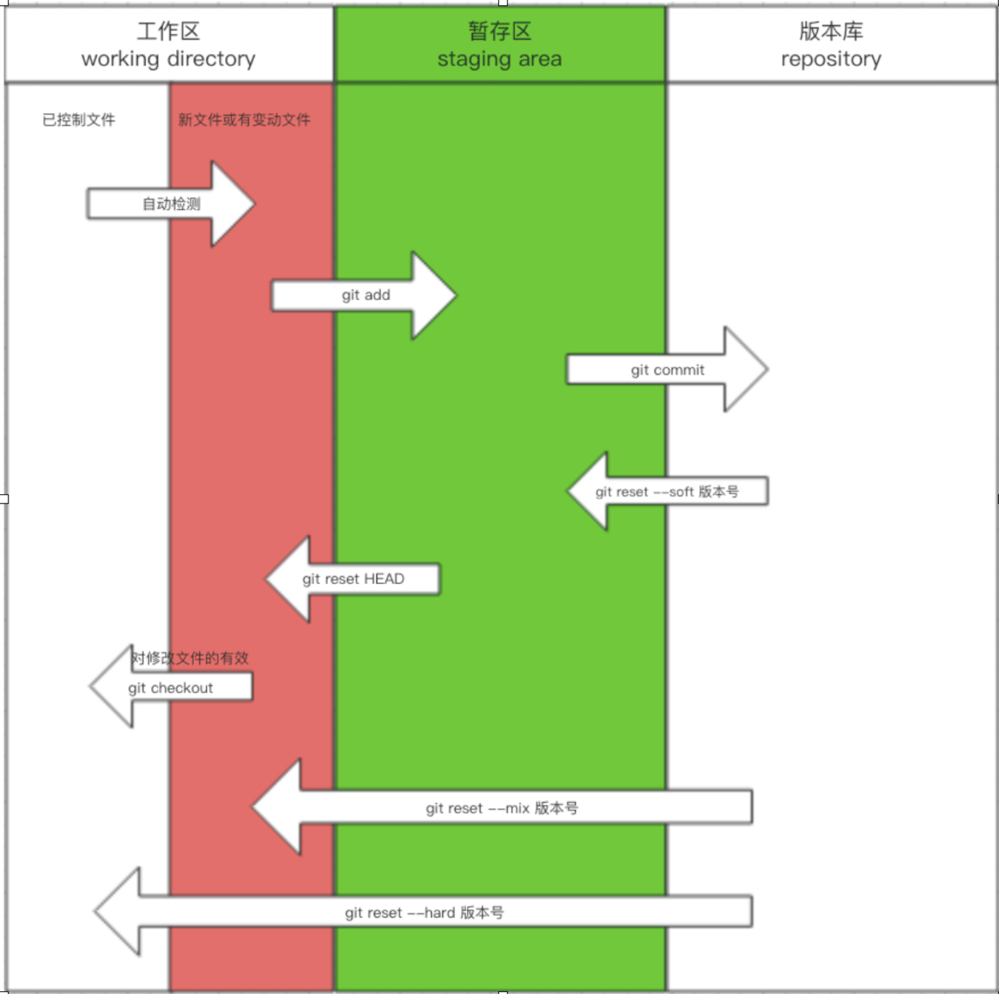
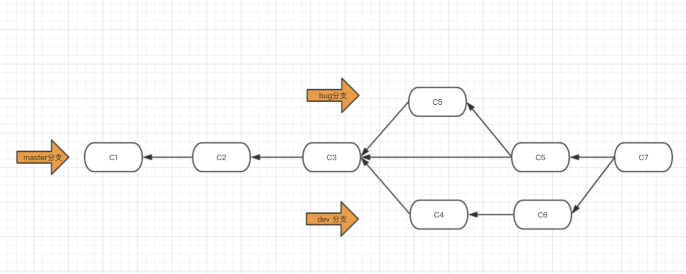

#  git

## 1. 安装
官方网站：https://git-scm.com/
官方操作文档：https://git-scm.com/book/zh/v2

#### 1.1 mac

 1. 查看是否安装

   ```
   shi@shideimac ~ % git --version                    查看 git 版本信息
   git version 2.24.2 (Apple Git-127)                 如果有说明已经安装，没有则下载安装
   shi@shideimac ~ % which git                        查看目录
   /usr/bin/git                                       git 所在的目录
   ```

1.1 附 mac 终端 推荐 Iterm2

   ```git
   shi@shideimac / % brew cask install iterm2         直接安装
   ```

## 2. 新建本地 - git 仓库（文件夹）

```git
1. 命令行添加：git 库存

      cd Desktop/                                           就是进入到Desktop 目录
      cd ..                                                 返回
      pwd                                                   查看当前路径
      mkdir /user/用户名/要建立的文件夹名字                     创建 git 仓库的文件夹 
      ls                                                    显示当前目录的内容
         mac： /Users/shi/Documents/pythonLearning/PythonLearning

2. 在某个路径下创建一个文件夹（用于存放 git 要管理的文件）  
         mac： /Users/shi/Documents/pythonLearning/PythonLearning
```


 #### 2.1 初始化仓库 （对一个文件夹只需要用一次即 一个项目只要一次）
   ```git
   ---------------------   一个项目只需要做一次这样的操作    --------------------------------
   git init                                                         让 git 成为管理员
   git config --global user.name '用于管理本地的管理员名字'             谁在管理这个仓库
   git config --global user.email '管理的邮箱地址'
   -------------------------------------------------------------------------------------
   git config user.name                                             查看设置的管理员名称
   git config user.email                                            .............邮箱
   git config -1                                                    查看 更多的信息
   ```

#### 2.2 工作区 （文件夹下有文件，但git中未保存的文件 红色的文件）
   ```git
   git status                 查看是否有 红色的文件（新增，修改未保存的文件）--> 未提交缓存区的内容
   ```

#### 2.3 缓存区 （ 文件 已经被 git 暂存 绿色的文件）
   ```git
   git add 要添加的文件.格式                                            添加 git 要管理的文件
   git add .                                                         添加 当前目录下所有的文件
   ```

#### 2.4 版本区 （ 对 git 保存的文件 形成专属的版本号（备份）
   ```git
   git commit -m '对当前版本描述的信息（修改，增加等什么）' 
                  ’‘ 里的内容 上传 github 中会在网页中提示。 
   ```

#### 2.5 查看版本
   ```git
   git log                                                          查看保存的版本记录
   ```

#### 2.6 回滚 -- 当前到前一个备份点
   ```git
   git log                                                          查看 版本号
   git reset --hard 版本号                                           回到某个备份点
   ```

#### 2.7 后悔了，想回去 （回到回滚前最后一次编辑的版本）
   ```git
   git reflog
   git reset --hard 版本号
   ```

## 3. 仓库的日常管理 (＊最常用的代码*)
```git
---------------------   新增 或 修改文件后的日常操作    --------------------------------
git status                                             查看未管理的文件
git add 文件名                                          添加要管理的文件名
git commit -m "描述信息"
git log                                                查看没有成功
--------------------   以后有了 github 别忘了推送    ---------------------------------
git push -u origin master（主线）/Development(开发)      推送到主线还是支线
```
 

## 4. 分支
一个软件的开发分：  正式版 和 测试版 。 测试版即是分支的意思，所有的开发都是在 分支上进行。
**用途**：
   1. 正式版是对客户使用， 分支是对正式版复制出来的添加与修改，不会影响到正式版。
   2. 当正式版有了紧急情况，通过分支可以随意切换
   
#### 4.1 查看分支
   ```git
   git branch
   ```

#### 4.2 创建分支
   ```git
   git branch 分支名称（dev开发的意思）
   ```

#### 4.3 切换分支
   ```git
   git chechout 分支名称 master/dev  主线与分支的切换
   ```

#### 4.4 合并分支 --> 分支项目完成（正式上线）--> 把分支合并的主线上
   ```git
   git merge 要合并的分支
   **注意**：
      分支切换后再合并
   ```

#### 4.5 删除分支
   ```git
   git branch -d 分支名称
   ```


## 5. github
**官方网站**                                                      https://github.com/
#### 5.1 建立项目


## 新电脑的操作

1. 新建目录（用于保存线上的文件夹和文件）


2. 克隆 线上文件

   git clone + 自己github库地址

   ```git
   git clone https://github.com/shiliu90/PythonLearning.git
   ```

   

3. ```git
   cd PythonLearning     --> 进入文件夹
   ```

4. ```git
   cat 文件名.格式         --> 打开某个文
   ```

5. ```git
   git log               --> 版本信息
   ```
   
6. ```git
   git branch           --> 查看当前的分支有多少   master 主分支
   ```

   

7. ```git
   git checkout dev(分支名)   --> 切换到分支
   ```

8. ```git
   提交代码
   git add .        -->  添加当前文件夹下所有的 文件
   
   git commit -m "提示的版本信息" 
   
   git push origin master    --> 推送到主支   又分支 git push origin dev --> 推到分支
   
   
   第2天到单位
   与上面推到的主，分支同步 如果是主支
   git pull origin master
   如果是分支
   git checkout dev
   git pull origin dev
   
   
   ....
   ```

