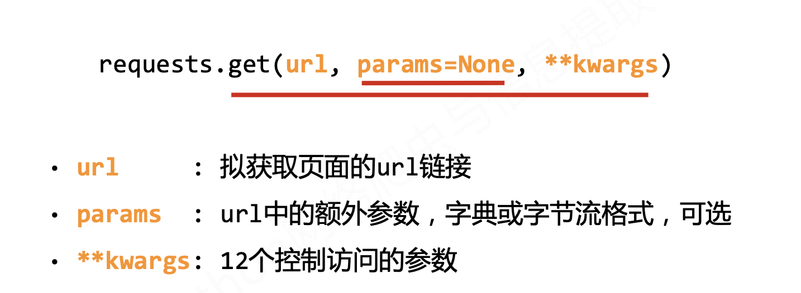
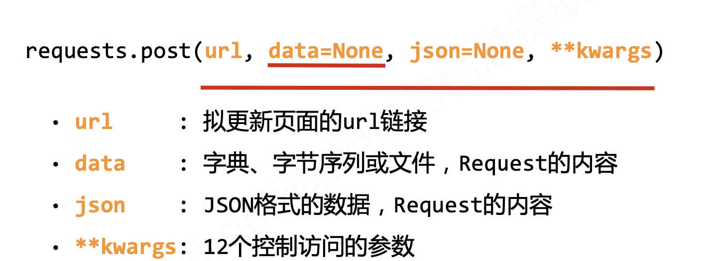
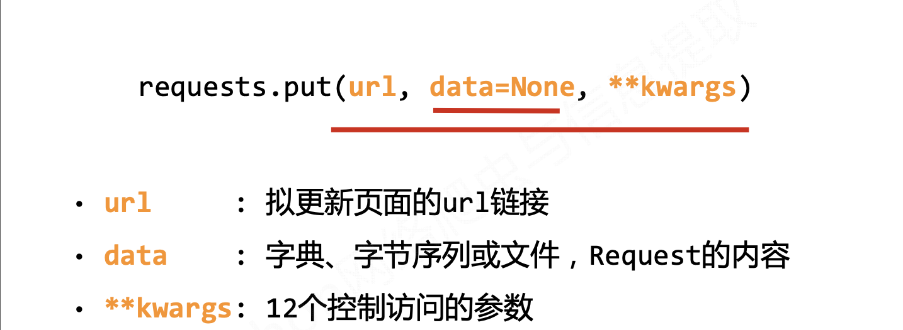
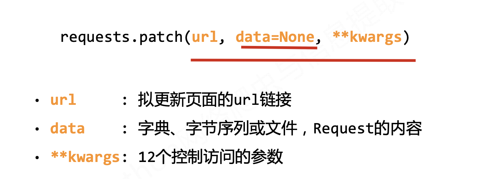
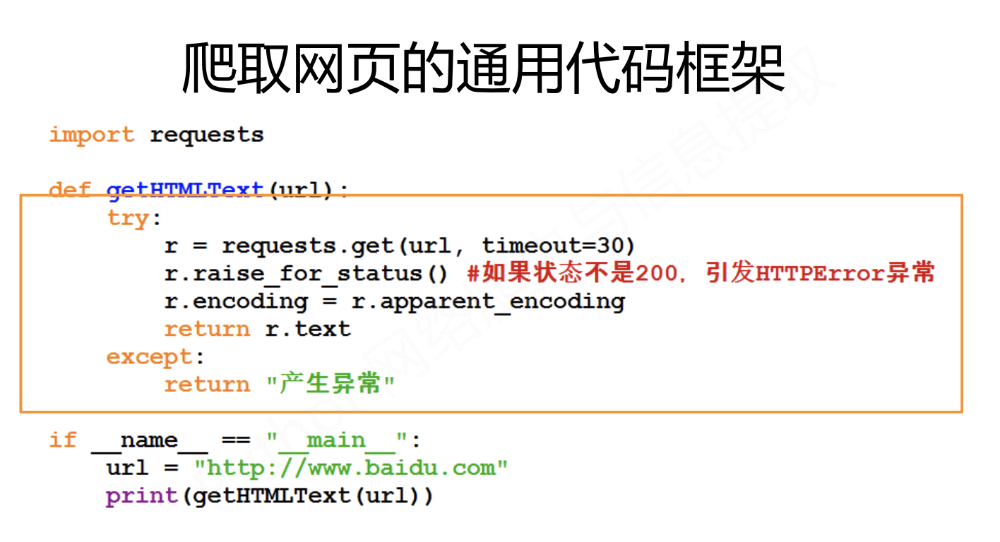

# 爬虫
## 1. 基础简介
  - **介绍**
通过Python(爬虫代码), 下载互联网上的数据到本地, 并且提取出我们需要的信息的过程就是就是爬虫  
网络爬虫（又被称为网页蜘蛛，网络机器人，或者经常的称为网页追逐者），是一种按照一定的规则，自动地抓取万维网信息的程序或者脚本。
----------------------------------------------------------------
  - **爬虫**在使用场景中的**分类**：
    - **通用爬虫**：
        - 抓取系统重要组成部分。抓取的是一整张页面数据。
    - **聚焦爬虫**：
        - 是建立在通用爬虫的基础之上。抓取的是页面中特定的局部内容。
    - **增量式爬虫**：
        - 检测网站中数据更新的情况。只会抓取网站中最新更新出来的数据。
----------------------------------------------------------------
  - **http协议**  概念：就是服务器和客户端进行数据交互的一种形式。
    - 常用请求头信息
        - **User-Agent**：请求载体的身份标识
        - C**onnection**：请求完毕后，是断开连接还是保持连接

    - 常用响应头信息
        - **Content-Type**：服务器响应回客户端的数据类型

    - https协议：
        - 安全的超文本传输协议
    - 加密方式
        - 对称秘钥加密
        - 非对称秘钥加密
        - 证书秘钥加密
------------------------------------------------------
----------------------------------------------------------------
## 2. requests (大佬)

[官方文档] <br> https://requests.readthedocs.io/en/master/
 - 安装：
   - win: pip install requests  (cmd)
 - **方法与属性**
    - 7个主要**请求方式**：
        | 7个主要请求方式        | 说明                                                     | 作用                                                |
        | ---------------------- | ----------------------------------------- | ------------------------------- |
        | requests.**get**()     | 获取**整个网页**内容的主要方法，对应于 HTTP 的 GET       | 获取url位置资源                                     |
        | requests.**head**()    | 获取网页的**头部信息**的方法， 对应于 HTTP 的 Head       | 获得该资源的头部信息                                |
        | requests.**post**()    | 向网页提交 **post 请求**的方法，对应于 HTTP 的 POST 请   | 请求向url位置后资源后附加新的数据                   |
        | requests.put()         | 向网页提交 put 请求的方法，对应于 HTTP 的 put            | 请求向URL位置存储一个资源，覆盖原URL位置的资源      |
        | requests.patch()       | 向网页提交 局部修改请求， 对应于 HTTP 的 patch           | 请求局部更新URL位置的资源，即改变该处资源的部分内容 |
        | requests.delete()      | 向网页提交删除请求， 对应于 HTTP 的 delete               | 请求删除URL位置存储的资源                           |
        | **requests.session()** | 在同⼀个Session实例例发出的所有请求都**保持同⼀个cookies** | (requests模块每次会 ⾃自动处理理cookies)             |
        <table>
            <tr>
                <td> 区别 </td>
                <td> 说明 </td>
            </tr>
            <tr>
                <td colspan="2">假设URL位置有一组数据UserInfo，包括UserID、UserName等20个字段 <br>需求:用户修改了UserName，其他不变.<br>采用PATCH，仅向URL提交UserName的局部更新请求.<br>采用PUT，必须将所有20个字段一并提交到URL，未提交字段被删除 <br>PATCH的最主要好处:节省网络带宽。</td>        
            </tr>
        </table>
        - GET是默认的HTTP请求方法，用于直接输⼊网址的方式去访问⽹页.
        - POST⽅法主是向Web服务器提交表单数据，通常表单提交时采用POST⽅方法
        - GET把请求参数包含在URL中，POST通过请求体传递参数
        - GET相对POST不安全，参数直接暴露在URL上，用来传递敏感信息
    ----------------------------------------------------------------
    - 14个**参数**：
         | 参数            | 说明                                                        |
         | --------------- | ----------------------------------------------------------- |
         | **url**         | 要请求的链接 （必须）                                       |
         | **params**      | 字典或字节序列，多用于 get 请求的 参数                      |
         | **data**        | 字典、字节序列或文件对象， 多用于 post,patch,put 请求的参数 |
         | json            | 作为 request  请求内容                                      |
         | **headers**     | 字典， 用于定制 HTTP **头部信息**                           |
         | cookies         | 字典或cookieJar，request 中的cookis                         |
         | auth            | 元组，支持HTTP认证功能                                      |
         | files           | 字典类型，传输文件                                          |
         | timeout         | 设定超时时间，秒为单位                                      |
         | proxies         | 字典类型，设定访问代理服务器，可增加登陆认证                |
         | allow_redirects | True/False, 默认为：True， 重定向开关                       |
         | stream          | True/False，默认：True,获取内容立即下载开关                 |
         | verify          | True/False,默认：True，认证SSL证书开关                      |
         | cert            | 本地SSL证书路径                                             |
        - cookies:
        因为网站需要记录用户是否登录时，就需要在用户登录后创建一些信息,并且要把这些信息记录在当前用户的浏览器中，记录的内容就是cookie.    
        用户使用当前的这个浏览器继续访问这个服务器时，会主动携带这个网站设置的cookie信息,cookie会在浏览器中记录信息，并且在访问时携带这个信息.  
        1，浏览器更换或删除cookie后，信息丢失
        2，cookie在浏览器中记录的信息是不安全的，因为不能记录敏感信息.
        - session:
        session是在服务器端进行数据的记录，并且在给每个用户会生成一个sessionID，并且把这个sessionID设置在用户的浏览器中，也就是设置为cookie
    ----------------------
    
    
    
    
    ----------------------------------------------------------------
    - **返回对象 -- response --> 包含爬虫返回的内容**：
        | **属性**                         | 说明                                                                                        |
        | -------------------------------- | ------------------------------------------------------------------------------------------- |
        | response.status_code             | Http请求的返回状态，200表示成功，404表示失败                                                |
        | **response.text**                | Http响应内容的字符串形式，即 url对应的页面内容                                              |
        | **response.content**             | Http响应内容的 二进制形式 （音频，图片，视频）                                              |
        | response.encoding                | 从Http header中 猜测响应内容编码方式 （调试乱码）                                           |
        | **response.apparent_encoding**   | 从内容中分析出响应内容编码方式 （**调试乱码**）                                             |
        | **方法**                         | 说明                                                                                        |
        | **response.raise_for)status() ** | 判断r.status_code是否等于200，不需要 增加额外的if语句，该语句便于利用try‐except进行异常处理 |
    ----------------------------------------------------------------   
    - **响应异常 -- Exception**
        | 异常                      | 说明                                        |
        | ------------------------- | ------------------------------------------- |
        | requests.ConnectionError  | 网络连接错误异常，如DNS查询失败、拒绝连接等 |
        | requests.HTTPError        | HTTP错误异常                                |
        | requests.URLRequired      | URL缺失异常                                 |
        | requests.TooManyRedirects | 超过最大重定向次数，产生重定向异常          |
        | requests.ConnectTimeout   | 连接远程服务器超时异常                      |
        | requests.Timeout          | 请求URL超时，产生超时异常                   |
    ---------------
- 通用代码框架：


 ----------------
  
### 反爬：**UA伪装**
    User-Agent : 标识了--> 浏览器的身份。

```python
    headers = {
    'User-Agent':'Mozilla/5.0 (Macintosh; Intel Mac OS X 10_14_6) AppleWebKit/537.36 (KHTML, like Gecko) Chrome/78.0.3904.97 Safari/537.36'
}
```
--------------
- **get( )**

```python
import requests

# 定义请求的url
# url = 'https://www.lmonkey.com/'
url = 'https://www.xicidaili.com/nn'

# 定义请求头信息
headers = {
    'User-Agent':'Mozilla/5.0 (Macintosh; Intel Mac OS X 10_14_6) AppleWebKit/537.36 (KHTML, like Gecko) Chrome/78.0.3904.97 Safari/537.36'
}

# 发起get请求
res = requests.get(url=url,headers=headers)

# 获取响应状态码
code = res.status_code
print(code)

# 响应成功后把响应的内容写入文件中
if code == 200:
    with open('./test.html','w') as fp:
        fp.write(res.text)
```
--------------------------------------
  - **post()**
```python
import requests


# 定义请求的URL
u = 'https://fanyi.baidu.com/sug'

# 定义请求头信息
headers = {
    'User-Agent':'Mozilla/5.0 (Macintosh; Intel Mac OS X 10_14_6) AppleWebKit/537.36 (KHTML, like Gecko) Chrome/78.0.3904.97 Safari/537.36'
}

# post发送的数据
data = {'kw':'你好'}

# 发送请求
res = requests.post(url=u,headers=headers,data=data)

# 接收返回数据
code = res.status_code
if code == 200:
    print('请求成功')
    data = res.json()
    if data['errno'] == 0:
        print('响应成功')
        k = data['data'][0]['k']
        v = data['data'][0]['v'].split(';')[-2]
        print(k,'====',v)
```
---------------------------------------------------
- **cookies()** `不建议使用`
```python
  import requests

# 定义请求的url
url = 'https://www.lmonkey.com/my/order'

# 定义请求头信息
headers = {
    'User-Agent':'Mozilla/5.0 (Macintosh; Intel Mac OS X 10_14_6) AppleWebKit/537.36 (KHTML, like Gecko) Chrome/78.0.3904.97 Safari/537.36',
    'cookie':'Hm_lvt_676e52e2eddd764819cab505b21e9ee8=1573357630; UM_distinctid=16e536c37bc234-0bd9595023c634-1c3c6a5a-13c680-16e536c37bd82b; CNZZDATA1277679765=592294367-1573357631-%7C1573357631; wechat_flag=eyJpdiI6IkszSEtaV3dOdmJYTXdsQkJYVmg2YkE9PSIsInZhbHVlIjoiOUdSWnpZVDVIbWRYTlR2WWo4WDJjRVQ5ZmNNUTJ6WklIaitndXA2YXNZR1o2Yk80ZEFoZGhPV3Zzbm9mbVNXZiIsIm1hYyI6Ijc3YTIwN2E4MWM1NDRkZDc4Y2E3NmYxMjJmODIwNDExNTEwNjM0YmZiZTJjOTA2MzQ1MGFhYTZjYjA1MzQzOWEifQ%3D%3D; XSRF-TOKEN=eyJpdiI6IjE5UE5oeXNWTml4bFVDNFE3TmFVUmc9PSIsInZhbHVlIjoiN2tWSGk2b3NXbklDMGZFZUNlMVE2T2kzYUxHMkpjaFJSZkhcL2pFRVR3cDlDNTB5dVhrRVpHZkN6UDVpRUxlb3MiLCJtYWMiOiJjMmI4NjRjZWZhMmVhODAzNDQwOTA3YThiZTAyNzNlMThjNDAyYzc0MjgxYzQ2ZTllZjAwODJiZDQwMmUyYjJkIn0%3D; _session=eyJpdiI6IkM2WklsTytwbGxzTjR2bkNLdjhmNlE9PSIsInZhbHVlIjoieEdaRDFlOGJXU1FSRlpFeENXUzc5NGZrd3VndUlpOVZoM3RYTGlrNnh4K0NLNlVnWUUwVU9WYmdMWUhvNjBtciIsIm1hYyI6IjU2OTc1ZjBkODExMzA1OWU0Y2Y5OGQzZWVlYTUxZTZkZDVkNmY3OWU4ZmY0MTM3ZDBlZDM5Zjg1MDhhM2UzZDYifQ%3D%3D; Hm_lpvt_676e52e2eddd764819cab505b21e9ee8=1573358797'
}

# 发起get请求
res = requests.get(url=url,headers=headers)

# 获取响应状态码
code = res.status_code
print(code)

# 响应成功后把响应的内容写入文件中
if code == 200:
    with open('./test.html','w') as fp:
        fp.write(res.text)
```
---------------------------------------------------------------
-  **session()**
```python
import requests

# 需要请求的目标地址
url = 'http://www.zmz2019.com/user/user'

# 登录请求的地址
loginurl = 'http://www.zmz2019.com/User/Login/ajaxLogin'

# 请求头
headers = {
    'User-Agent':'Mozilla/5.0 (Macintosh; Intel Mac OS X 10_14_6) AppleWebKit/537.36 (KHTML, like Gecko) Chrome/78.0.3904.97 Safari/537.36'
}

# 如果需要爬虫程序主动记录cookie并且携带cookie，那么在使用requests之前先调用session方法
# 并且使用session方法返回的对象发送请求即可
req = requests.session()

# 登录请求时的数据
data = {
'account': 'yichuan@itxdl.cn',
'password': 'pyTHON123',
'remember': '1',
'url_back': 'http://www.zmz2019.com/user/user'

}
# 发起登录请求
res = req.post(url=loginurl,headers=headers,data=data)

# 判断状态
code = res.status_code
print(code)

if code == 200:
    # 发起新的请求，去获取目标数据
    res = req.get(url=url,headers=headers)
    with open('rr.html','w') as fp:
        fp.write(res.text)


# 思考作业：
'''
1.session()起到的作用
2.去思考如何用这样的思路去完成 学习猿地 的登录 （能写出思路即可）
'''
```

-----------------------------------------------------
---------------------------------------------------------
## 3. 数据分析
#### 3.1. Xpath
&nbsp;&nbsp;&nbsp;&nbsp; XPath 的选择功能⼗分强⼤大，它提供了了⾮常简洁明了的路路径选择表达式。另外，它还提供了超过 100 个内建函数，⽤于字符串串、数值、时间的匹配以及节点、序列的处理等，⼏乎所有想要定位的节点 都可以用 XPath 来选择。  

[官方文档]&nbsp;&nbsp; https://www.w3.org/TR/xpath/
[参考学习]&nbsp;&nbsp; https://www.w3school.com.cn/xpath/index.asp &nbsp;&nbsp;,&nbsp;&nbsp; https://lxml.de/
-----------------------------------------------------------------------------
1. **XPath节点 （Node)**
  - 七种类型的节点。
    - 元素
    - 属性
    - 文本
    - 命名空间
    - 处理指令
    - 注释
    - 文档（根）节点
```xml
<?xml version="1.0" encoding="ISO-8859-1"?>

<bookstore>  (文档节点)

<book>
  <title lang="en">Harry Potter</title>   lang=“en” (属性节点)
  <author>J K. Rowling</author>    （元素节点）
  <year>2005</year>
  <price>29.99</price>
</book>

</bookstore>

---------------------------------------------------------------------------
- 基本值（或称原子值，Atomic value）
      基本值是无父或无子的节点。
            基本值的例子：
            J K. Rowling
            "en"
- 项目（Item）
      项目是基本值或者节点。

---------------------------------------------------------------------------
**节点关系**

    父（Parent）
        每个元素以及属性都有一个父。
            在上面的例子中，book 元素是 title、author、year 以及 price 元素的父：

    子（Children）
        元素节点可有零个、一个或多个子。
            在上面的例子中，title、author、year 以及 price 元素都是 book 元素的子：

    同胞（Sibling）
        拥有相同的父的节点
            在上面的例子中，title、author、year 以及 price 元素都是同胞：

    先辈（Ancestor）
        某节点的父、父的父，等等。
            在上面的例子中，title 元素的先辈是 book 元素和 bookstore 元素：

    后代（Descendant）
        某个节点的子，子的子，等等。
            在上面的例子中，bookstore 的后代是 book、title、author、year 以及 price 元素：  
```
-------------------------------------------------------------------------------------
2. **XPath语法**
```xml
<?xml version="1.0" encoding="ISO-8859-1"?>

<bookstore>

<book>
  <title lang="eng">Harry Potter</title>
  <price>29.99</price>
</book>

<book>
  <title lang="eng">Learning XML</title>
  <price>39.95</price>
</book>

</bookstore>

```

- **选取节点** 
    | 表达式   | 描述                                                       |
    | -------- | ---------------------------------------------------------- |
    | nodename | 选取此节点的所有子节点。                                   |
    | /        | 从根节点选取。                                             |
    | //       | 从匹配选择的当前节点选择文档中的节点，而不考虑它们的位置。 |
    | .        | 选取当前节点。                                             |
    | ..       | 选取当前节点的父节点。                                     |
    | @        | 选取属性。                                                 |

    - 实例化
        | 路径表达式      | 结果                                                                                        |
        | --------------- | ------------------------------------------------------------------------------------------- |
        | bookstore       | 选取 bookstore 元素的所有子节点。                                                           |
        | /bookstore      | 选取根元素 bookstore。注释：假如路径起始于正斜杠( / )，则此路径始终代表到某元素的绝对路径！ |
        | bookstore/book  | 选取属于 bookstore 的子元素的所有 book 元素。                                               |
        | //book          | 选取所有 book 子元素，而不管它们在文档中的位置。                                            |
        | bookstore//book | 选择属于 bookstore 元素的后代的所有 book 元素，而不管它们位于 bookstore 之下的什么位置。    |
        | //@lang         | 选取名为 lang 的所有属性。                                                                  |

- **谓语**： 谓语用来**查找某个特定的节点**或者包含某个指定的值的节点。谓语被嵌在方括号中。
    | 路径表达式                         | 结果                                                                                      |
    | ---------------------------------- | ----------------------------------------------------------------------------------------- |
    | /bookstore/book[1]                 | 选取属于 bookstore 子元素的第一个 book 元素。                                             |
    | /bookstore/book[last()]            | 选取属于 bookstore 子元素的最后一个 book 元素。                                           |
    | /bookstore/book[last()-1]          | 选取属于 bookstore 子元素的倒数第二个 book 元素。                                         |
    | /bookstore/book[position() < 3]    | 选取最前面的两个属于 bookstore 元素的子元素的 book 元素。                                 |
    | //title[@lang]                     | 选取所有拥有名为 lang 的属性的 title 元素。                                               |
    | //title[@lang='eng']               | 选取所有 title 元素，且这些元素拥有值为 eng 的 lang 属性。                                |
    | /bookstore/book[price>35.00]       | 选取 bookstore 元素的所有 book 元素，且其中的 price 元素的值须大于 35.00。                |
    | /bookstore/book[price>35.00]/title | 选取 bookstore 元素中的 book 元素的所有 title 元素，且其中的 price 元素的值须大于 35.00。 |

- **选取未知节点**
    | 通配符 | 描述                 |
    | ------ | -------------------- |
    | \*     | 匹配任何元素节点。   |
    | @*     | 匹配任何属性节点。   |
    | node() | 匹配任何类型的节点。 |
    - 实例化
        | 路径表达式                         | 结果                                                                                |
        | ---------------------------------- | ----------------------------------------------------------------------------------- |
        | /bookstore/*                       | 选取 bookstore 元素的所有子元素。                                                   |
        | //*                                | 选取文档中的所有元素。                                                              |
        | //title[@*]                        | 选取所有带有属性的 title 元素。                                                     |
        | - **选取若干路径** : 表达式中使用“ | ”运算符，您可以选取若干个路径                                                       |
        | 路径表达式                         | 结果                                                                                |
        | ---                                | ---                                                                                 |
        | //book/title \| //book/price       | 选取 book 元素的所有 title 和 price 元素。                                          |
        | //title \| //price                 | 选取文档中的所有 title 和 price 元素。                                              |
        | /bookstore/book/titl \| //price    | 选取属于 bookstore 元素的 book 元素的所有 title 元素，以及文档中所有的 price 元素。 |
-----------------------------------------------------------------------------------------------------------------
#### 3.2. BeautifulSoup (bx4)
#### 3.3. re 正则

## 4. 数据存储
#### 1. json 文件
#### 2. MySQL 数据库
#### 3. MongoDB 数据库

## 5. 进程 与 线程 种类

